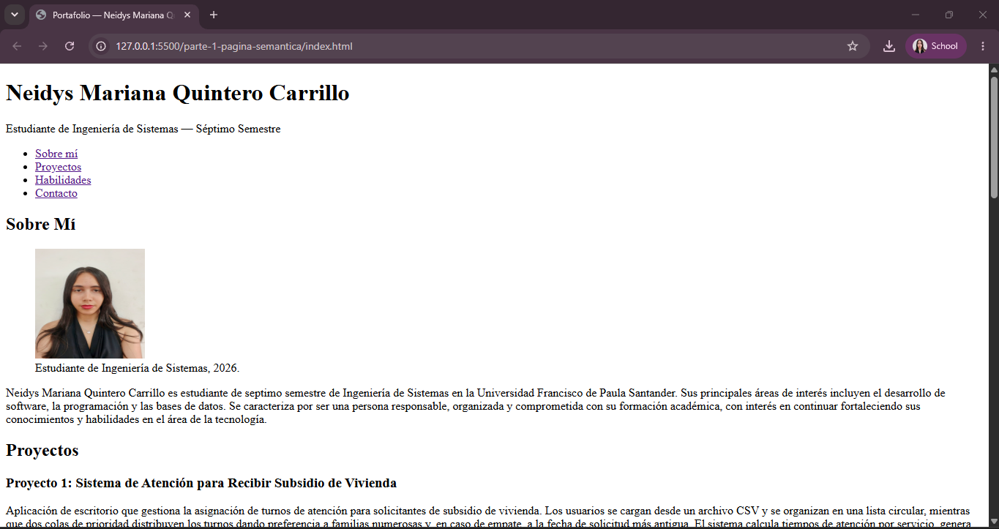
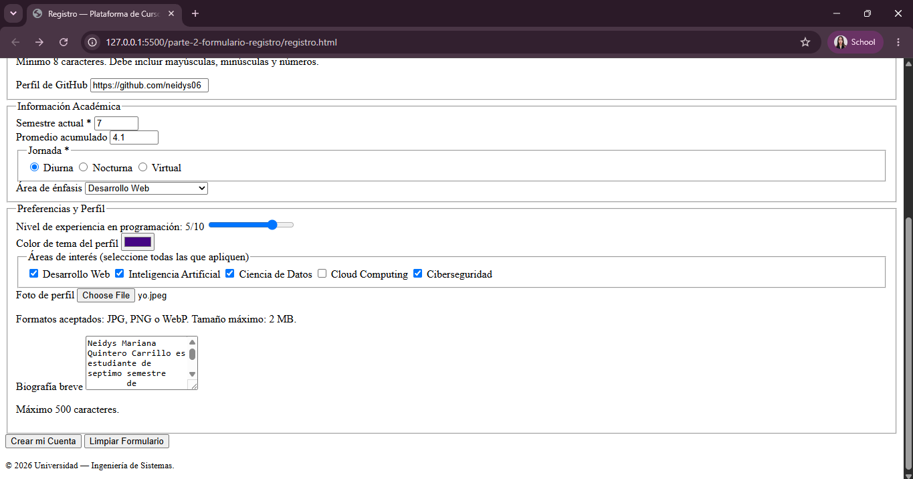
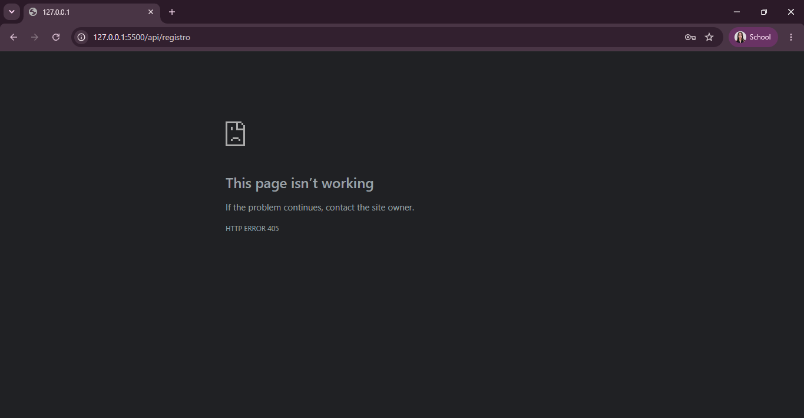

# Post-contenido — Unidad 2: HTML5 Básico

## Descripción
Repositorio del laboratorio de la Unidad 2 de Programación Web — Séptimo
Semestre. Contiene dos partes: página de portafolio con etiquetas semánticas
de HTML5 (`parte-1-pagina-semantica/`) y formulario de registro con
validación nativa HTML5 (`parte-2-formulario-registro/`).

## Parte 1 — Página semántica
Página de portafolio personal que implementa `header`, `nav`, `main`,
`section`, `article`, `aside` y `footer`, con listas `ul`/`ol`/`dl`, un
bloque de multimedia (audio) con su recurso de accesibilidad asociado
(transcripción), una sección de preguntas frecuentes con
`details`/`summary`, y meta tags de SEO. Ver `parte-1-pagina-semantica/`.

## Parte 2 — Formulario de registro
Formulario de registro universitario con más de 10 tipos de input HTML5
(text, email, password, tel, url, date, number, range, color, file,
checkbox, radio, hidden, textarea, select) agrupados en fieldsets, con
validación nativa y atributos ARIA. Ver `parte-2-formulario-registro/`.

## Decisiones de diseño

### 1. Estructura semántica de "Logros y Certificaciones" (Parte 1)
Se eligió la **Opción A**: cada logro se marca como un `<article>`
independiente. Se aplicó el criterio de la guía teórica (sección 2.3):
"¿tiene sentido por sí solo fuera del sitio?". Una certificación (por
ejemplo, un curso o un reconocimiento) es un dato autocontenido: tiene
nombre, fecha e institución propios, y podría copiarse tal cual a un CV o a
un perfil de LinkedIn sin perder sentido, sin depender del resto de la
página. Por eso corresponde a contenido redistribuible por sí mismo, que es
justamente la definición de `<article>` en la guía.

### 2. Formato multimedia de la introducción personal (Parte 1)
Se eligió la **Opción B**: audio con transcripción dentro de
`
`/`
`. El clip es una introducción hablada de 20-40
segundos sin necesidad de mostrar entorno ni gestos, por lo que el video no
aporta información adicional relevante frente al audio. El audio es más
simple de grabar (no requiere edición de video ni generar un archivo `.vtt`
sincronizado por timestamps) y de todas formas cumple el principio
"Perceptible" de WCAG (guía 7.1) gracias a la transcripción completa y
literal incluida en el `
`, que cualquier usuario —incluyendo
quienes usan lector de pantalla o no pueden reproducir audio— puede leer.

### 3. Marcado del campo opcional "teléfono" (Parte 2)
Se eligió la **Opción A**: agregar el texto "(opcional)" directamente en el
contenido del `<label>`. Esta alternativa es perceptible para **todos** los
usuarios sin depender de que el navegador o el lector de pantalla exponga
correctamente la relación `aria-describedby`; al ser visible en el propio
texto del label, no requiere ningún soporte técnico adicional para
comunicar que el campo no es obligatorio, lo que la hace más robusta que
depender de un atributo ARIA para este caso puntual.

## Cómo visualizar el proyecto
1. Clonar el repositorio: `git clone https://github.com/neidys06/quintero-post1-u2`
2. Abrir la carpeta en Visual Studio Code
3. Clic derecho en `index.html` o `registro.html` → "Open with Live Server"

## Capturas de pantalla
### Parte 1 — Página semántica (portafolio)

### Parte 2 — Formulario de registro

### Parte 2 — Formulario de registro intentando enviar

## Validación
- Parte 1: validada en https://validator.w3.org/ sin errores de error.
- Parte 2: validación nativa del navegador probada en los campos
  `required`, `pattern`, `min`/`max` y `minlength` (ver checklist en la
  guía de contenido, Paso 8 de la Parte 2).
